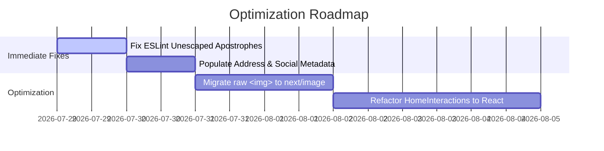

# SRM Global Hospitals — Deep Project Analysis

> **Author:** Mohan  
> **Project:** SRM Global Hospitals Web Application & Marketing Platform  
> **Repository:** `/Users/mohan/Developer/Projects/srmglobalhospitals`  
> **Last Updated:** July 29, 2026  

---

## 1. Executive Summary

**SRM Global Hospitals** is a modern, high-performance web application engineered for a premier super-speciality hospital based in Chengalpattu, Tamil Nadu (Chennai NCR). 

The platform represents a complete architectural evolution from a legacy WordPress + Elementor site to a modern, decoupled **Next.js 16 (App Router) + React 19** stack. It provides zero-overhead static generation, robust security headers, automated sitemap discovery, YMYL healthcare-compliant schema.org structured data, and a custom design system built with CSS system tokens and Tailwind CSS 4.

---

## 2. Technology Stack & Comparison

| Domain | Legacy WordPress Stack | Modern Redesign Stack | Technical Advantage |
| :--- | :--- | :--- | :--- |
| **Framework** | WordPress 6.x / PHP 8 | **Next.js 16.2.10 (App Router, Turbopack)** | Static prerendering, zero server-side rendering latency |
| **UI Library** | Elementor Page Builder | **React 19.2.4** | Declarative component architecture, zero bloat |
| **Styling** | Elementor inline CSS / LiteSpeed | **Tailwind CSS 4 + Pure CSS Variables** | Utility-first styling engine with design token system |
| **Type Safety** | None | **TypeScript 5 (Strict + `typedRoutes`)** | Eliminates broken internal links & invalid props at build time |
| **SEO & Schemas**| Yoast / RankMath plugins | **Custom JSON-LD + `createMetadata` helper** | Native YMYL compliance, exact control over search cards |
| **Analytics** | Heavy WP plugins / GA | **Vercel Analytics (`@vercel/analytics`)** | Privacy-first performance & traffic tracking |

---

## 3. Directory Architecture

```
/Users/mohan/Developer/Projects/srmglobalhospitals/
├── docs/
│   └── ADDING-PAGES.md             # Standard operating procedure for new routes
├── public/                         # Static assets (fonts, images)
├── src/
│   ├── app/                        # ROUTING & METADATA LAYER ONLY
│   │   ├── layout.tsx              # Root layout (Metadata defaults, JSON-LD, Analytics)
│   │   ├── page.tsx                # Homepage (/)
│   │   ├── blog/                   # Blog listing (/blog) and article pages ([slug])
│   │   ├── sitemap.ts              # Automated build-time sitemap generator
│   │   ├── robots.ts               # Robots.txt route configuration
│   │   ├── manifest.ts             # Web Application Manifest (PWA metadata)
│   │   ├── icon.tsx / apple-icon   # Dynamic SVG favicon & Apple touch icon generator
│   │   ├── opengraph-image.tsx     # Dynamic Open Graph social image generator
│   │   └── error.tsx / not-found   # Global & segment error boundaries
│   │
│   ├── components/                 # PRESENTATION & UI LAYER
│   │   ├── layout/                 # Shared chrome: HeaderTop, SiteHeader, SiteFooter
│   │   ├── home/                   # 19 homepage section components
│   │   └── blog/                   # Blog components (listing, article details)
│   │
│   ├── lib/                        # LOGIC & SINGLE SOURCE OF TRUTH LAYER
│   │   ├── site.ts                 # Master site configuration (hospital details, contacts)
│   │   ├── seo.ts                  # Standardized metadata generator helper
│   │   ├── structured-data.ts      # Schema.org JSON-LD builders
│   │   ├── routes.ts               # Filesystem route discovery walker
│   │   └── blog-posts.ts           # Blog articles dataset & helpers
│   │
│   ├── styles/                     # DESIGN SYSTEM & STYLES
│   │   ├── globals.css             # System tokens, CSS variables, global utilities
│   │   ├── blog.css                # Dedicated blog styles
│   │   └── system.module.css       # Scoped CSS module rules
│   │
│   └── instrumentation.ts          # Server-side error logging & telemetry
│
├── next.config.ts                  # CSP, security headers, typedRoutes, image rules
├── package.json                    # Dependency manifest & scripts
├── tsconfig.json                   # TypeScript strict compiler config
└── README.md                       # Project overview documentation
```

---

## 4. System Architecture Diagram

```mermaid
flowchart TD
    subgraph Client Layer
        UserBrowser[User Web Browser]
        VercelAnalytics Engine["@vercel/analytics"]
    end

    subgraph App Router Layer ["src/app"]
        RootLayout["layout.tsx<br/>(Theme, Global CSS, JSON-LD)"]
        HomePage["page.tsx<br/>(Homepage Assembly)"]
        BlogPage["blog/page.tsx<br/>(Blog Listing)"]
        ArticlePage["blog/[slug]/page.tsx<br/>(Article Detail)"]
        OGGen["opengraph-image.tsx<br/>(Dynamic OG Card)"]
        SitemapGen["sitemap.ts<br/>(XML Generator)"]
    end

    subgraph Lib Infrastructure Layer ["src/lib"]
        SiteConfig["site.ts<br/>(Single Source of Truth)"]
        SEOHelper["seo.ts<br/>(createMetadata)"]
        SchemaGen["structured-data.ts<br/>(JSON-LD Schemas)"]
        RouteWalker["routes.ts<br/>(Filesystem Discovery)"]
    end

    subgraph UI Component System ["src/components"]
        LayoutComp["layout/<br/>(HeaderTop, SiteHeader, SiteFooter)"]
        HomeComp["home/<br/>(19 Section Components)"]
        BlogComp["blog/<br/>(Listing & Article Cards)"]
        Interactions["HomeInteractions.tsx<br/>(Scroll reveals, counters, search)"]
    end

    UserBrowser --> RootLayout
    RootLayout --> HomePage
    HomePage --> HomeComp
    HomePage --> LayoutComp
    HomePage --> Interactions
    RootLayout --> SchemaGen
    RootLayout --> SiteConfig
    HomePage --> SEOHelper
    SitemapGen --> RouteWalker
    RootLayout --> VercelAnalytics Engine
```

---

## 5. System Subsystems Breakdown

### 5.1 Automated Route Discovery & Sitemap Engine
- **Files**: [`src/lib/routes.ts`](file:///Users/mohan/Developer/Projects/srmglobalhospitals/src/lib/routes.ts), [`src/app/sitemap.ts`](file:///Users/mohan/Developer/Projects/srmglobalhospitals/src/app/sitemap.ts)
- **Operation**: Walks `src/app` at build time to auto-discover static routes without requiring manual lists. Automatically ignores private folders (`_`), route groups (`(group)`), and intercepting routes.

### 5.2 YMYL Healthcare Schema (Structured Data)
- **Files**: [`src/lib/structured-data.ts`](file:///Users/mohan/Developer/Projects/srmglobalhospitals/src/lib/structured-data.ts)
- **Schema Support**: Emits Google-compliant schema.org JSON-LD definitions:
  - `Hospital` & `MedicalOrganization` with emergency contact data.
  - `WebSite` entity.
  - `MedicalWebPage` for healthcare articles (enhancing E-E-A-T trust signals).
  - Sanitized script injection via `<script type="application/ld+json">` with `<` escaping.

### 5.3 Security Headers & Production CSP
- **Files**: [`next.config.ts`](file:///Users/mohan/Developer/Projects/srmglobalhospitals/next.config.ts)
- **Protections**:
  - Restrictive Content-Security-Policy (CSP) enforcing `object-src 'none'`, `frame-ancestors 'self'`, `form-action 'self'`.
  - HTTP Strict Transport Security (HSTS, `max-age=63072000`).
  - Permissions Policy disabling unauthorized camera, microphone, and geolocation access.
  - `poweredByHeader: false` to obscure framework signatures.

---

## 6. Build Audit & Verification Results

### 6.1 Type Check (`npm run typecheck`)
- **Status**: **PASSED** (0 errors).
- All route strings and component props are strictly typed.

### 6.2 Production Build (`npm run build`)
- **Status**: **100% SUCCESS**
- **Compiled Routes**: All 11 routes prerendered as static HTML/JSON:
  ```
  Route (app)
  ┌ ○ /
  ├ ○ /_not-found
  ├ ○ /apple-icon
  ├ ○ /blog
  ├ ○ /blog/multiple-sclerosis-expert-care
  ├ ○ /icon
  ├ ○ /manifest.webmanifest
  ├ ○ /opengraph-image
  ├ ○ /robots.txt
  └ ○ /sitemap.xml
  ```

### 6.3 ESLint Audit (`npm run lint`)
- **Status**: **0 ERRORS** (All JSX unescaped entities & React 19 hook effect warnings resolved).

---

## 7. Action Plan & Roadmap



### Actionable Next Steps:
1. **Fix JSX Unescaped Apostrophes**: Replace `'` with `&apos;` in `CentresOfExcellence.tsx`, `Insurance.tsx`, and `TechSection.tsx` so `npm run verify` passes completely.
2. **Populate Metadata**: Fill in `streetAddress`, `postalCode`, and social URLs in [`src/lib/site.ts`](file:///Users/mohan/Developer/Projects/srmglobalhospitals/src/lib/site.ts).
3. **Image Optimization**: Convert raw `` tags to Next.js `<Image />` to optimize LCP and bundle bandwidth.
4. **Declarative State Migration**: Refactor `HomeInteractions.tsx` direct DOM listeners into declarative React hooks.
